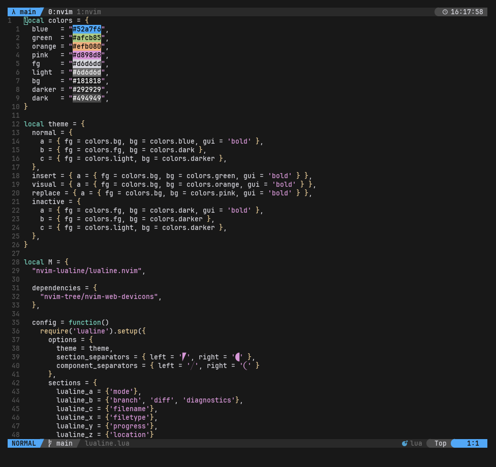

# My Neovim config

This is my personal Neovim config. It's under a public domain licence, so you can do whatever you want with it.

## Screenshots:

The topbar is not from Neovim but from Tmux, if you want to build a similar workflow you can find my config on [this gist](https://gist.github.com/Mth-Ryan/983bb1f3b10f985d9f174fc29ecd19b5).
